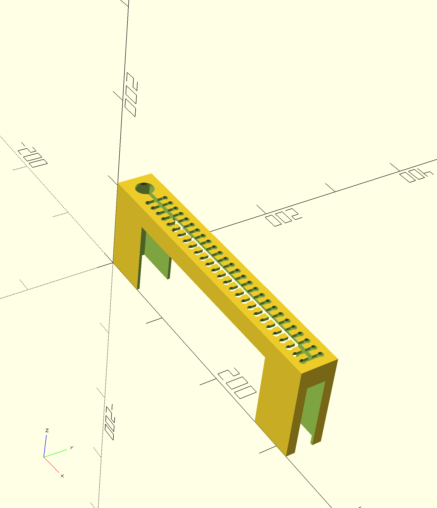

# Cable Archive

A parametric cable organizer designed in OpenSCAD for 3D printing.

## Description

Cable Archive is a modular insert that can be installed in drawers or containers to organize all types of cables. The design consists of a flat panel with perimeter walls and specialized slots for cable management. Optional fins provide additional separation between slots, and a bottom lid can enclose the organizer completely.

### Features

- **Main cable slot**: Allows the cable to pass through while retaining the connectors
- **Wide entry point**: Circular opening (25mm diameter) facilitates initial cable insertion
- **Perpendicular slots**: Multiple cross-slots for securing cables at various points
- **Visible storage**: Both connectors remain visible simultaneously
- **Easy extraction**: Simply pull the connectors to remove cables
- **Modular design**: Multiple inserts can be stacked to cover entire drawers
- **Cross-shaped cutout**: Base walls have cutouts for easy material access
- **Optional fins**: Vertical separators between perpendicular slots for enhanced organization
- **Optional bottom lid**: Base panel to fully enclose the organizer
- **Optional stacking slab**: Additional slab below the bottom lid for improved stackability
- **Fully parametric**: Customizable to your specific needs

## Design Components

### Panel
- Flat top panel with main cable slot
- Default dimensions: 310mm × 60mm × 3mm (height × width × thickness)

### Base Walls
- Vertical walls around the perimeter (default 20mm height, 2mm thickness)
- Cross-shaped cutout pattern for material reduction
- Optional fins for additional separation between slots
- Optional bottom lid to enclose the organizer
- Optional stacking slab below the bottom lid for improved stackability

### Fins
- Optional vertical separators positioned between perpendicular slots
- Configurable width and height percentage relative to wall height
- Cut by main slots and cross cutouts for integration

### Bottom Lid
- Optional base panel matching top panel dimensions
- Provides complete enclosure when enabled
- Positioned below the base walls

### Main Slot
- Circular entry (25mm diameter) for easy cable insertion
- Narrow channel (3mm wide) to retain connectors
- Optional rounded end for smooth cable routing
- Customizable margins and positioning

### Perpendicular Slots
- Multiple slots perpendicular to the main slot
- Automatically calculated spacing (default 25mm)
- Rounded ends (3mm radius) for gentle cable guidance
- Can be enabled/disabled independently

## Usage

1. Open `cable_archive.scad` in OpenSCAD
2. Adjust parameters in the Customizer panel (Window > Customizer)
3. Press F5 for preview or F6 for full render
4. Export to STL: File > Export > Export as STL
5. 3D print with your preferred settings

## Customizable Parameters

### Panel Dimensions
- `panel_width`: Width of the panel (default: 60mm)
- `panel_height`: Height/length of the panel (default: 310mm)
- `panel_thickness`: Thickness of the top panel (default: 3mm)

### Main Slot Configuration
- `enable_main_slot`: Toggle main cable slot on/off (default: true)
- `slot_width`: Width of the cable channel (default: 3mm)
- `entry_diameter`: Diameter of the entry hole (default: 25mm)
- `end_rounding`: Round the slot end (default: true)
- `slot_margin_horizontal`: Margin from panel edge (default: 10mm)
- `slot_margin_vertical`: Vertical position margin (default: 10mm)

### Perpendicular Slots Configuration
- `enable_perpendicular_slots`: Toggle perpendicular slots on/off (default: true)
- `perpendicular_slot_spacing`: Distance between slots (default: 25mm)
- `perpendicular_slot_end_radius`: Radius of slot ends (default: 3mm)
- `perpendicular_slot_margin`: Margin from panel edges (default: 5mm)

### Base Walls Configuration
- `wall_height`: Height of perimeter walls (default: 20mm)
- `wall_thickness`: Thickness of the walls (default: 2mm)
- `enable_bottom_lid`: Toggle bottom lid on/off (default: true)

### Stacking Configuration
- `enable_stacking_slab`: Toggle stacking slab on/off (default: true, requires bottom lid enabled)
- `stacking_slab_padding`: Padding around stacking slab (default: 5mm)
- `stacking_slab_depth`: Thickness of stacking slab (default: 2mm)

### Fins Configuration
- `enable_fins`: Toggle fins on/off (default: true)
- `fin_width`: Width of each fin (default: 2mm)
- `fin_percentage`: Percentage of wall height fins occupy (default: 0.5)

### Cross Cutout Configuration
- `cross_margin_width`: Horizontal margin for cutout (default: 5mm)
- `cross_margin_height`: Vertical margin for cutout (default: 5mm)
- `cross_margin_top`: Top margin to preserve (default: 2mm)

### Rendering Quality
- `$fn`: Circle resolution (default: 50)

## Printing Recommendations

- **Layer height**: 0.2mm recommended
- **Infill**: 15-20% is sufficient
- **Supports**: Not required with proper orientation
- **Orientation**: Print with the panel facing up
- **Material**: PLA, PETG, or ABS work well

## License

Creative Commons
